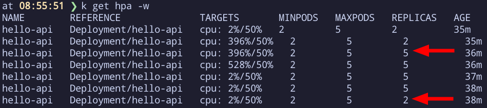
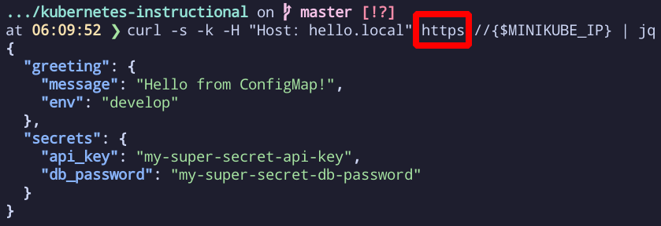
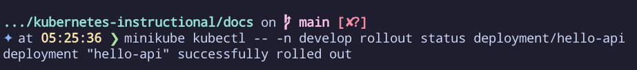

# Kubernetes Starter: Ingress + Probes + Autoscaling

A beginner-friendly project for learning Kubernetes the **practical way**.  
We’ll deploy a small **FastAPI “Hello World” app** on minikube with Ingress, health probes, resource limits, and autoscaling.

---

## 🚀 What this is

A minimal, production-minded Kubernetes deployment of a single service with:

- **Ingress (NGINX)** – route external traffic to the app  
- **Readiness/Liveness probes** – so Kubernetes knows when pods are healthy  
- **Resource requests/limits** – CPU & memory constraints for predictable scheduling  
- **HorizontalPodAutoscaler (HPA)** – auto-scale pods up/down based on CPU  
- **ConfigMap & Secret examples** – inject config and secrets without rebuilding images  

---

## ✅ Prerequisites

Make sure you have these installed:

- [Docker](https://docs.docker.com/get-docker/)  
- [kubectl](https://kubernetes.io/docs/tasks/tools/)  
- [minikube](https://minikube.sigs.k8s.io/docs/start/)  
- (Optional) [`hey`](https://github.com/rakyll/hey) or [`ab`](https://httpd.apache.org/docs/2.4/programs/ab.html) for load testing  

---

## 🏃 Quick start

```bash
make dev-up       # builds image, starts minikube, applies manifests
make test-load    # runs load to trigger HPA
make status       # shows pods, svc, hpa
make down         # cleanup
```

Once deployed, open:

- App: [http://hello.local](http://hello.local)  
- FastAPI Docs: [http://hello.local/docs](http://hello.local/docs)  
- ReDoc: [http://hello.local/redoc](http://hello.local/redoc)  

---

## 📸 Screenshots

- ✅ `kubectl get hpa` showing scale-up


- 🌐 Curl showing `https://hello.local`



- 📦 `kubectl rollout status deployment/hello-app` 
  
 

---

## 📚 Documentation

Full step-by-step walkthrough lives in [docs/](./docs):

- [00-overview.md](./docs/00-overview.md) – project goals, architecture, repo map  
- [01-prereqs-setup.md](./docs/01-prereqs-setup.md) – install and start minikube  
- [02-app-container.md](./docs/02-app-container.md) – build and run the FastAPI app  
- [03-k8s-deploy.md](./docs/03-k8s-deploy.md) – deploy the app into Kubernetes  
- …and more through security, troubleshooting, and FAQ.  

---

## 🙌 Why this project?

Kubernetes can feel overwhelming. This repo gives you a **guided, repeatable workflow** that covers the 80% you’ll need for real-world apps — without cloud vendor lock-in or complex tooling.

---

## ⚠️ Disclaimer

This project was created as a learning resource with the assistance of AI tools.  All code and documentation have been **reviewed and tested for accuracy**, but it is intended **for educational purposes only** and is **not production-ready**.

