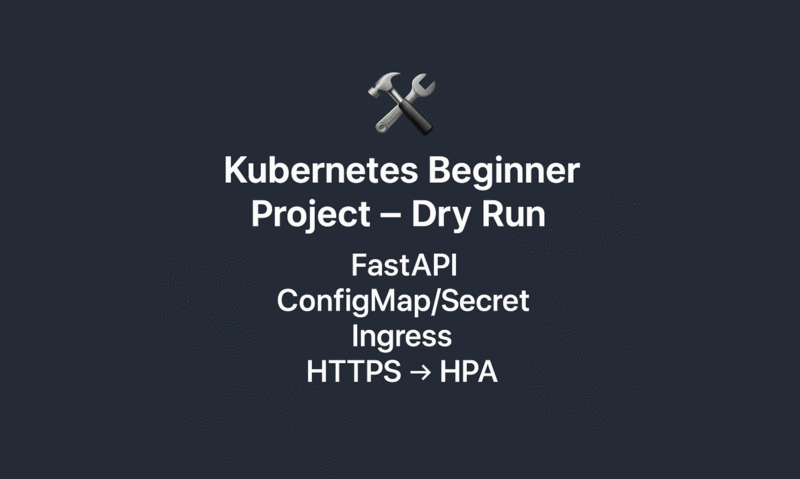

# Kubernetes Starter: Ingress + Probes + Autoscaling

A beginner-friendly project for learning Kubernetes the **practical way**.  
We’ll deploy a small **FastAPI “Hello World” app** on minikube with Ingress, health probes, resource limits, and autoscaling.

---

## 🚀 What this is

A minimal, production-minded Kubernetes deployment of a single service with:

- **Ingress (NGINX)** – route external traffic to the app  
- **Readiness/Liveness probes** – so Kubernetes knows when pods are healthy  
- **Resource requests/limits** – CPU & memory constraints for predictable scheduling  
- **HorizontalPodAutoscaler (HPA)** – auto-scale pods up/down based on CPU  
- **ConfigMap & Secret examples** – inject config and secrets without rebuilding images  

---

## ✅ Prerequisites

Make sure you have these installed:

- [Docker](https://docs.docker.com/get-docker/)  
- [kubectl](https://kubernetes.io/docs/tasks/tools/)  
- [minikube](https://minikube.sigs.k8s.io/docs/start/)  
- (Optional) [`hey`](https://github.com/rakyll/hey) or [`ab`](https://httpd.apache.org/docs/2.4/programs/ab.html) for load testing  

---

## 🏃 Quick start

Clone the repo:

```bash
git clone https://github.com/grndlvl/k8s-hello-app.git
cd k8s-hello-app
```

Start by reading the overview:

```bash
open docs/00-overview.md
```

When you’re ready to begin hands-on, check out the first step:

```bash
git checkout step-01-prereqs
```

Then follow [docs/01-prereqs-setup.md](./docs/01-prereqs-setup.md).  
Each doc ends with a **⏭️ Next Step** footer telling you which tag to checkout next.

---

## 📸 Screenshots

- ✅ `kubectl get hpa` showing scale-up  
  

- 🌐 Curl showing `https://hello.local`  
  

- 📦 `kubectl rollout status deployment/hello-app`  
  

---

## 🎬 Capstone Demo

See the whole project in action — from deploying the app, checking Ingress,  
and then watching the Horizontal Pod Autoscaler scale the pods under load:



---

## 📚 Documentation

Full step-by-step walkthrough lives in [docs/](./docs):

- [00-overview.md](./docs/00-overview.md) – project goals, architecture, repo map  
- [01-prereqs-setup.md](./docs/01-prereqs-setup.md) – install and start minikube  
- [02-app-container.md](./docs/02-app-container.md) – build and run the FastAPI app  
- [03-k8s-deploy.md](./docs/03-k8s-deploy.md) – deploy the app into Kubernetes  
- [04-configmap-secret.md](./docs/04-configmap-secret.md) – inject config & secrets  
- [05-ingress-tls.md](./docs/05-ingress-tls.md) – ingress with TLS  
- [06-hpa-scaling.md](./docs/06-hpa-scaling.md) – autoscaling with HPA  
- [07-security-basics.md](./docs/07-security-basics.md) – pod/container hardening  
- [08-troubleshooting.md](./docs/08-troubleshooting.md) – common issues  
- [09-runbook-ops.md](./docs/09-runbook-ops.md) – ops runbook  
- [10-faq.md](./docs/10-faq.md) – frequently asked questions

---

## 🌿 Tutorial Tags

Each step of the tutorial is published as a **git tag**.  
The `main` branch contains the **final, complete version** of the project.

- `step-01-prereqs` → environment setup  
- `step-02-app-container` → FastAPI app + Dockerfile  
- `step-03-k8s-deploy` → namespace, deployment, service  
- `step-04-configmap-secret` → environment variables & secrets  
- `step-05-ingress-tls` → ingress with TLS  
- `step-06-hpa-scaling` → autoscaling with HPA  
- `step-07-security-basics` → pod/container hardening  

👉 Use the **⏭️ Next Step** footer in each doc to know which tag to checkout next.

---

## 🙌 Why this project?

Kubernetes can feel overwhelming. This repo gives you a **guided, repeatable workflow** that covers the 80% you’ll need for real-world apps — without cloud vendor lock-in or complex tooling.

---

## ⚠️ Disclaimer

This project was created as a learning resource with the assistance of AI tools.  
All code and documentation have been **reviewed and tested for accuracy**, but it is intended **for educational purposes only** and is **not production-ready**.
