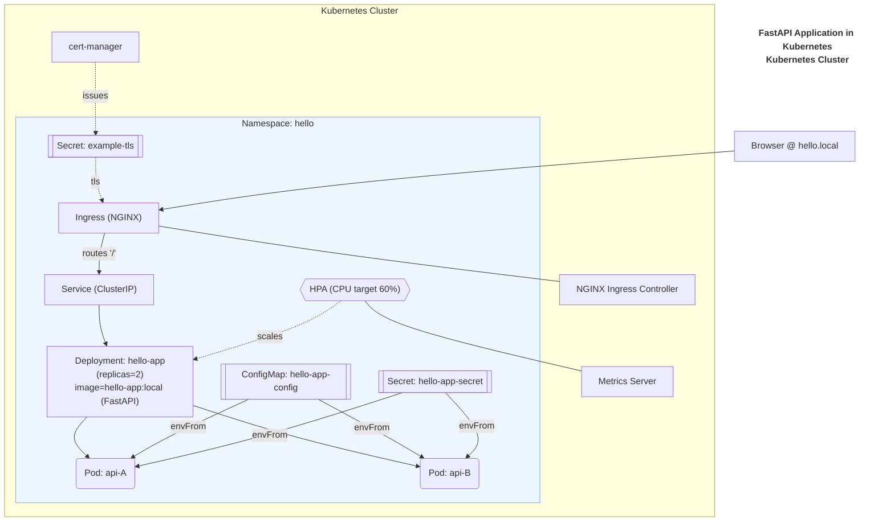

# Kubernetes Starter: Ingress + Probes + Autoscaling

Welcome! 🎉 This project (repo: **`k8s-hello-app`**) is a hands-on starter for learning Kubernetes fundamentals by deploying a small FastAPI “Hello World” service (`hello.local`) in a local minikube cluster.

You’ll practice the most important Kubernetes concepts — Deployments, Services, Ingress, ConfigMaps, Secrets, resource limits, and autoscaling — in a safe, local environment. By the end, you’ll have confidence running and operating a real-world style workload in Kubernetes.

---

# Overview

**Goal:** Deploy a small FastAPI service on Kubernetes with Ingress, probes, ConfigMap/Secret, and HPA.

---

## 🚀 Project Goals

- Learn how to containerize a small web application.
- Deploy the app to Kubernetes using `kubectl` and YAML manifests.
- Understand core resources: Pods, Deployments, Services, ConfigMaps, Secrets.
- Expose the app to the outside world with an NGINX ingress controller and TLS certificates.
- Add scaling with the Horizontal Pod Autoscaler (HPA).
- Practice basic troubleshooting and security concepts.
- Walk away with a **repeatable workflow** you can reuse for future projects.

---

## 📚 Learning Outcomes

By completing this project, you should be able to:

- Explain the difference between a Pod, Deployment, and Service.
- Write and apply Kubernetes YAML manifests.
- Verify resources with `kubectl get` and `kubectl describe`.
- Manage configuration securely using ConfigMaps and Secrets.
- Route traffic into your cluster with Ingress + TLS.
- Configure scaling with HPA based on CPU usage.
- Debug common issues with logs and troubleshooting commands.
- Operate a simple app with Kubernetes like a real-world engineer.

---

## 🛠️ Tech Stack

This project uses:

- **FastAPI** – a lightweight Python web framework for our demo app.
- **Docker** – to build and containerize the app.
- **Kubernetes** – our orchestration platform (using **minikube** locally).
- **kubectl** – command-line tool to interact with the cluster.
- **NGINX Ingress Controller** – for routing external traffic into the cluster.
- **cert-manager** – for automatically managing TLS certificates (self-signed for demo).
- **Horizontal Pod Autoscaler (HPA)** – to scale our app up and down under load.

---

## 🏗️ Architecture

- FastAPI container → **Deployment** (2 replicas) → **Service** (ClusterIP) → **Ingress (NGINX)**
- Config via **ConfigMap/Secret**
- Autoscaling via **HPA (CPU-based)**



---

## 🎯 Success Criteria

- App reachable at **https://hello.local**
- HPA scales under load (**2 → 5 replicas**)
- Config change visible **without an image rebuild**

---

## 📂 Repo Map

Here’s how the repo is organized:

```
├── app/ # FastAPI demo application
│   ├── Dockerfile
│   ├── main.py
│   └── requirements.txt
│
├── docs/ # Step-by-step tutorial docs (follow in order)
│   ├── 00-overview.md
│   ├── 01-prereqs-setup.md
│   ├── 02-app-container.md
│   ├── 03-k8s-deploy.md
│   ├── 04-configmap-secret.md
│   ├── 05-ingress-tls.md
│   ├── 06-hpa-scaling.md
│   ├── 07-security-basics.md
│   ├── 08-troubleshooting.md
│   ├── 09-runbook-ops.md
│   ├── 10-faq.md
│   └── images/
│
├── k8s/
│   └── manifests/
│       ├── deployment.yaml
│       ├── hpa.yaml
│       ├── ingress.yaml
│       ├── namespace.yaml
│       └── service.yaml
│
├── Makefile
└── README.md
```

---

## 🔀 Following Along

This repo is structured to support both **learn by doing** and **reference only** styles.

- The **`start` branch** is where you should begin if you want to build along step by step.
- The **`main` branch** contains the **final completed project**.
- Each step is also published as a **git tag**, so you can check the code at any stage.

👉 Recommended:
Stay on the `start` branch and follow the docs in order.
Only use tags if you want to compare your work with a reference snapshot.

> 💡 To see available step tags:
> ```bash
> git tag -l "step-*"
> ```

---

## ✅ What You’ll Accomplish

By the end of this tutorial, you will:

- Run a FastAPI web app inside Kubernetes.
- Access it securely with HTTPS through an Ingress.
- Scale it automatically with HPA.
- Know how to debug and operate your own Kubernetes workloads.

This project is a safe, local sandbox -- experiment as much as you like!

---

## 🎬 Capstone Preview

By the end of this tutorial, your app will look like this in Kubernetes:


- App reachable at **https://hello.local**
- Ingress routing requests to your pods
- HPA automatically scaling from 2 → 5 replicas under load

---

## ⏭️ Next Step

Continue to [01-prereqs-setup.md](01-prereqs-setup.md).

💡 Tip: Make sure you’ve checked out the **`start` branch** if you’re following along from scratch.
The `main` branch contains the finished project, while `start` is your clean slate.
