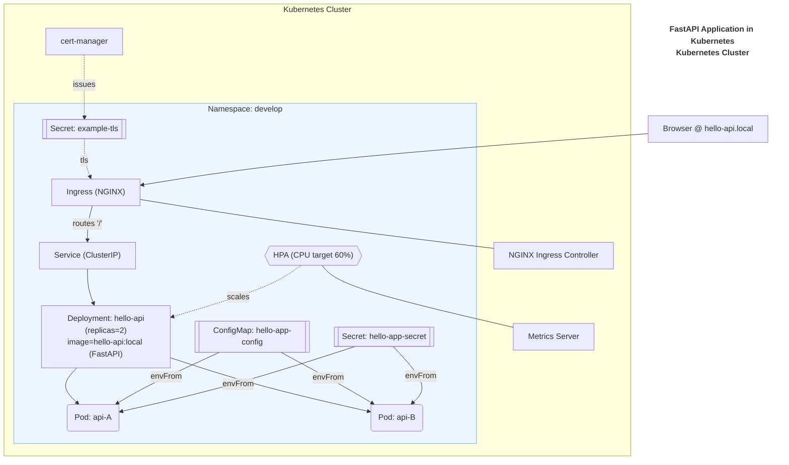

# Kubernetes Starter: Ingress + Probes + Autoscaling

Welcome! 🎉 This project (repo: **`k8s-hello-app`**) is a hands-on starter for learning Kubernetes fundamentals by deploying a small FastAPI “Hello World” service (`hello.local`) in a local minikube cluster.  

You’ll practice the most important Kubernetes concepts — Deployments, Services, Ingress, ConfigMaps, Secrets, resource limits, and autoscaling — in a safe, local environment. By the end, you’ll have confidence running and operating a real-world style workload in Kubernetes.

---

# Overview

**Goal:** Deploy a small FastAPI service on Kubernetes with Ingress, probes, ConfigMap/Secret, and HPA.  

---

## 🚀 Project Goals

- Learn how to containerize a small web application.  
- Deploy the app to Kubernetes using `kubectl` and YAML manifests.  
- Understand core resources: Pods, Deployments, Services, ConfigMaps, Secrets.  
- Expose the app to the outside world with an NGINX ingress controller and TLS certificates.  
- Add scaling with the Horizontal Pod Autoscaler (HPA).  
- Practice basic troubleshooting and security concepts.  
- Walk away with a **repeatable workflow** you can reuse for future projects.  

---

## 📚 Learning Outcomes

By completing this project, you should be able to:  

- Explain the difference between a Pod, Deployment, and Service.  
- Write and apply Kubernetes YAML manifests.  
- Verify resources with `kubectl get` and `kubectl describe`.  
- Manage configuration securely using ConfigMaps and Secrets.  
- Route traffic into your cluster with Ingress + TLS.  
- Configure scaling with HPA based on CPU usage.  
- Debug common issues with logs and troubleshooting commands.  
- Operate a simple app with Kubernetes like a real-world engineer.  

---

## 🛠️ Tech Stack

This project uses:  

- **FastAPI** – a lightweight Python web framework for our demo app.  
- **Docker** – to build and containerize the app.  
- **Kubernetes** – our orchestration platform (using **minikube** locally).  
- **kubectl** – command-line tool to interact with the cluster.  
- **NGINX Ingress Controller** – for routing external traffic into the cluster.  
- **cert-manager** – for automatically managing TLS certificates (self-signed for demo).  
- **Horizontal Pod Autoscaler (HPA)** – to scale our app up and down under load.  

---

## 🏗️ Architecture

- FastAPI container → **Deployment** (2 replicas) → **Service** (ClusterIP) → **Ingress (NGINX)**  
- Config via **ConfigMap/Secret**  
- Autoscaling via **HPA (CPU-based)**  



---

## 🎯 Success Criteria

- App reachable at **https://hello.local**  
- HPA scales under load (**2 → 5 replicas**)  
- Config change visible **without an image rebuild**  

---

## 📂 Repo Map

Here’s how the repo is organized:

```
├── app/ # FastAPI demo application
│ ├── Dockerfile # Container build instructions
│ ├── main.py # FastAPI entrypoint
│ └── requirements.txt # Python dependencies
│
├── docs/ # Step-by-step tutorial docs (follow in order)
│ ├── 00-overview.md
│ ├── 01-prereqs-setup.md
│ ├── 02-app-container.md
│ ├── 03-k8s-deploy.md
│ ├── 04-configmap-secret.md
│ ├── 05-ingress-tls.md
│ ├── 06-hpa-scaling.md
│ ├── 07-security-basics.md
│ ├── 08-troubleshooting.md
│ ├── 09-runbook-ops.md
│ ├── 10-faq.md
│ └── architecture-chart.mermaid # Text-based diagram (Mermaid)
│
├── k8s/
│ ├── examples/ # Example YAMLs (safe dummy values)
│ │ ├── config.yaml
│ │ ├── secret.yaml
│ │ └── tls-secret.yaml
│ │
│ └── manifests/ # Kubernetes manifests for the app
│ ├── deployment.yaml
│ ├── hpa.yaml
│ ├── ingress.yaml
│ ├── namespace.yaml
│ └── service.yaml
│
├── Makefile # Shortcut commands for build/deploy
└── README.md # Quick project introduction
```

- **`app/`** – the FastAPI service you’ll containerize.  
- **`docs/`** – the tutorial, written step by step (read in order).  
- **`k8s/examples/`** – example configs with demo-safe values.  
- **`k8s/manifests/`** – the real manifests you’ll apply to Kubernetes.  
- **`Makefile`** – handy shortcuts (`make build`, `make deploy`, etc.).  
- **`README.md`** – a quick start pointer to this tutorial.

Each step builds on the previous one -- follow them in order for best results.  

---

## ✅ What You’ll Accomplish

By the end of this tutorial, you will:  

- Run a FastAPI web app inside Kubernetes.  
- Access it securely with HTTPS through an Ingress.  
- Scale it automatically with HPA.  
- Know how to debug and operate your own Kubernetes workloads.  

This project is a safe, local sandbox -- experiment as much as you like!  

---

👉 Next step: [01-prereqs-setup.md](01-prereqs-setup.md)  
