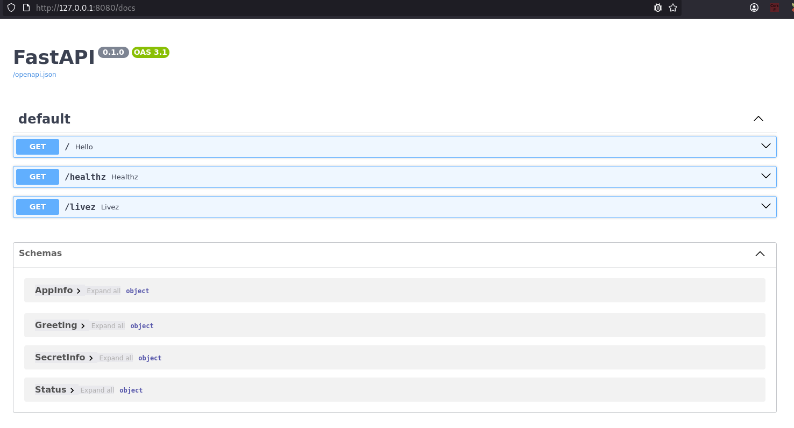
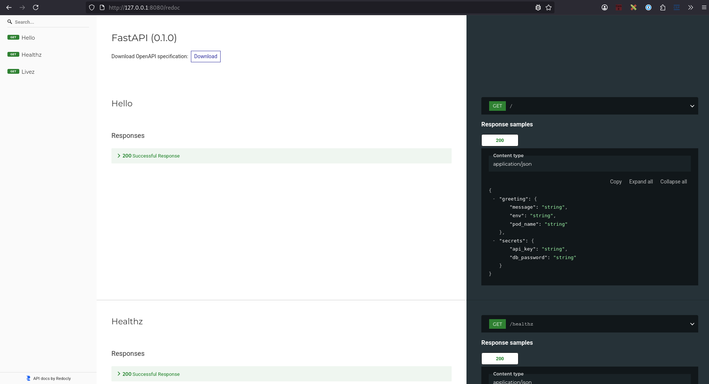
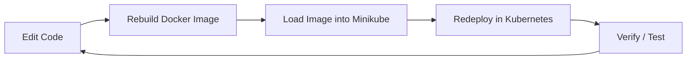

# 02 – Build the FastAPI App Container

With the cluster ready, let’s build and package our application.  
We’ll use **FastAPI**, containerized with Docker, and configure it so Kubernetes can read settings from environment variables, ConfigMaps, and Secrets.

---

## 📝 Step 1. Review the App Code

In `app/main.py` you’ll find the FastAPI service:

```python
# app/main.py
import os
from fastapi import FastAPI
from pydantic import BaseModel

app = FastAPI()

class Greeting(BaseModel):
    message: str
    env: str
    pod_name: str

class SecretInfo(BaseModel):
    api_key: str
    db_password: str

class AppInfo(BaseModel):
    greeting: Greeting
    secrets: SecretInfo

class Status(BaseModel):
    status: str

@app.get("/", response_model=AppInfo)
def hello() -> AppInfo:
    greeting = Greeting(
        message=os.getenv("APP_MESSAGE", "Hello from Kubernetes!!!"),
        env=os.getenv("APP_MODE", "dev"),
        pod_name=os.getenv("HOSTNAME", "uknown")
    )

    secrets = SecretInfo(
        api_key=os.getenv("SECRET_API_KEY", "<unset>"),
        db_password=os.getenv("SECRET_DB_PASSWORD", "<unset>")
    )

    return AppInfo(
        greeting=greeting,
        secrets=secrets
    )

@app.get("/healthz")
def healthz():
    return Status(status="ok")

@app.get("/livez")
def livez() -> Status:
    return Status(status="alive")
```

Key points:  
- Reads values from environment variables (`APP_MESSAGE`, `APP_MODE`, etc.).  
- Returns both **greeting info** and **secrets info** (demo-safe).  
- Provides `/healthz` and `/livez` endpoints for Kubernetes probes.  
- Uses **Pydantic models** (`Greeting`, `SecretInfo`, `AppInfo`, `Status`) so responses are strongly typed.  

> ⚠️ **Note:** Any time you change `main.py` (or anything in the `app/` directory), you must **rebuild the Docker image** and reload it into minikube before Kubernetes can run the updated code.  

---

## 📦 Step 2. Review the Dockerfile

In `app/Dockerfile` we use a **multi-stage build** for smaller images and a **non-root runtime user** for security:

```dockerfile
# -------- Build stage --------
FROM python:3.12-slim AS build

ENV PYTHONDONTWRITEBYTECODE=1 \
    PYTHONUNBUFFERED=1

RUN apt-get update && apt-get install -y --no-install-recommends \
    build-essential gcc \
 && rm -rf /var/lib/apt/lists/*

WORKDIR /app

COPY requirements.txt .

RUN python -m venv /opt/venv \
 && /opt/venv/bin/pip install --no-cache-dir --upgrade pip \
 && /opt/venv/bin/pip install --no-cache-dir -r requirements.txt

COPY . /app
RUN /opt/venv/bin/python -m compileall -q /app

# -------- Runtime stage --------
FROM python:3.12-slim

RUN groupadd --gid 10001 app \
 && useradd --uid 10001 --gid 10001 --system --no-create-home --shell /usr/sbin/nologin app

COPY --from=build /opt/venv /opt/venv
COPY --from=build /app /app
ENV PATH="/opt/venv/bin:${PATH}"

WORKDIR /app
RUN chown -R 10001:10001 /app
USER 10001:10001

EXPOSE 8080
CMD ["uvicorn", "main:app", "--host", "0.0.0.0", "--port", "8080"]
```

### 🔐 Why use UID `10001`?

- Running containers as **root (UID 0)** is a security risk.  
- Kubernetes best practices recommend non-root users so that, even if compromised, the container can’t access host-level privileges.  
- We chose `10001` (an arbitrary non-privileged UID) so it doesn’t overlap with common system accounts.  
- Many security scanners (like Trivy, Aqua) will flag root containers — this avoids those warnings.

### 🏗️ Why two stages (Build vs Runtime)?

- **Build stage** includes heavy tools (`gcc`, `pip`, cache) needed only for installing Python packages.  
- **Runtime stage** is lightweight: just Python + our app + its dependencies.  
- This keeps the final image **smaller, faster to pull**, and reduces the attack surface.  
- The app runs from a pre-built virtual environment (`/opt/venv`) copied from the build stage.

---

## 🛠️ Step 3. Build the Container Image

From the project root, build the Docker image:

```bash
docker build -t hello-app:1.0 ./app
```

Verify it was created:

```bash
docker images | grep hello-app
```

Expected output:

```
hello-app   1.0   abc123def456   2 minutes ago   120MB
```

---

## ▶️ Step 4. Run the Container Locally

Run the container in the foreground:

```bash
docker run -p 8080:8080 hello-app:1.0
```

You should see `uvicorn` logs streaming in the terminal.  
Leave it running while you test in another terminal.  

Verify the endpoints:

```bash
curl http://localhost:8080/
curl http://localhost:8080/healthz
curl http://localhost:8080/livez
```

Expected JSON from `/` (values will vary by environment):

```json
{
  "greeting": {
    "message": "Hello from Kubernetes!!!",
    "env": "dev",
    "pod_name": "e1c3b4fdabce"
  },
  "secrets": {
    "api_key": "<unset>",
    "db_password": "<unset>"
  }
}
```

When finished, return to the terminal running Docker and stop the container with:

```
Ctrl-C
```

---

## 📚 Step 5. Explore FastAPI’s Built-in Docs

One of FastAPI’s best features is **interactive API documentation**.  
This works because our endpoints use **Pydantic models** with defined data types.  

Open these URLs in your browser:

- Swagger UI: [http://localhost:8080/docs](http://localhost:8080/docs)  
- ReDoc: [http://localhost:8080/redoc](http://localhost:8080/redoc)  

You’ll see:  
- A **live playground** where you can try requests without `curl`.  
- Data models (`Greeting`, `SecretInfo`, `AppInfo`) automatically documented.  
- Clear request/response schemas — perfect for debugging and learning.

  
  

---

## 📤 Step 6. Load Image into minikube

Make the image available to your minikube cluster.

Option 1 — load directly:

```bash
minikube image load hello-app:1.0
```

Option 2 — build inside minikube’s Docker:

```bash
eval $(minikube docker-env)
docker build -t hello-app:1.0 ./app
```

Verify it exists in minikube:

```bash
minikube image ls | grep hello-app
```

---

## 🔄 Developer Workflow

When working with Kubernetes, your development loop looks like this:

1. **Edit code** → change `main.py` or other files.  
2. **Rebuild image** → `docker build -t hello-app:1.0 ./app`.  
3. **Load into minikube** → `minikube image load hello-app:1.0`.  
4. **Redeploy** in Kubernetes (we’ll cover this in the next step).  
5. **Verify** with `kubectl get pods` + `curl http://hello.local/`.  

Here’s the cycle:



> ⚠️ **Important note about minikube images:**  
> minikube maintains its **own internal image repository**. This means:  
> - If you rebuild the same tag (`hello-app:1.0`) locally, Kubernetes may still run the *old* image inside minikube.  
> - To fix this, either:  
>   - **Delete the old image** in minikube (`minikube image rm hello-app:1.0`), then reload it.  
>   - **Use a new tag** (e.g. `hello-app:1.1`) each time you rebuild.  
> - Forgetting this step is one of the most common beginner mistakes.  

---

## ⏭️ Next Step

You’ve just built and containerized the FastAPI app. 🎉  

Continue to [03-k8s-deploy.md](03-k8s-deploy.md) where we’ll deploy the app into Kubernetes
