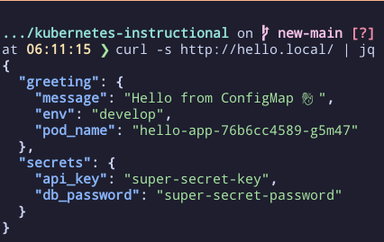
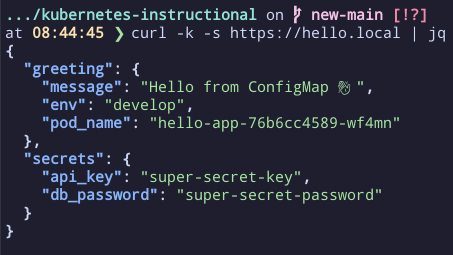

# 🌐 Step 5: Ingress + TLS

In this step, we’ll expose `hello-app` outside the cluster using **Ingress** and secure it with **TLS**.  
Our local hostname will be `hello.local`.

---

## 0) Verify Ingress prerequisites

> 📌 Make sure you’ve already enabled the Ingress controller and pointed `hello.local` to your cluster as described in [01-prereqs-setup.md](01-prereqs-setup.md).

Check that the Ingress controller is running:

```bash
kubectl -n ingress-nginx get pods
```

Expected (pods should be `Running`):

```
ingress-nginx-controller-xxxxx   1/1   Running   0   1m
```

---

## 1) Create the Ingress (HTTP)

📄 `k8s/manifests/ingress.yaml`

```yaml
apiVersion: networking.k8s.io/v1
kind: Ingress
metadata:
  name: hello-app-ingress
  namespace: hello
  annotations:
    nginx.ingress.kubernetes.io/ssl-redirect: "false"  # allow HTTP before TLS is set up
spec:
  ingressClassName: nginx
  rules:
  - host: hello.local
    http:
      paths:
      - path: /
        pathType: Prefix
        backend:
          service:
            name: hello-app
            port:
              number: 80
```

Apply it:

```bash
kubectl apply -f k8s/manifests/ingress.yaml
```

Verify:

```bash
kubectl get ingress -n hello
kubectl describe ingress hello-app-ingress -n hello
```

Expected (note the ADDRESS and HOSTS):

```
NAME               CLASS   HOSTS         ADDRESS         PORTS   AGE
hello-app-ingress  nginx   hello.local   192.168.49.2    80      10s
```

---

## 2) Test HTTP

```bash
curl http://hello.local/
```

If you skipped editing `/etc/hosts`, use:

```bash
MINIKUBE_IP=$(minikube ip)
curl -i -H "Host: hello.local" "http://$MINIKUBE_IP/"
```

Expected:

```
HTTP/1.1 200 OK
...
{"message":"Hello from ConfigMap 👋", ...}
```



---

## 3) Add TLS (self-signed)

We’ll create a **TLS Secret** outside of the repo and then enable HTTPS on the Ingress.

### 3.1 Generate a cert/key for `hello.local`

Option A — OpenSSL:

```bash
mkdir -p .secrets/tls
openssl req -x509 -nodes -days 365 \
  -newkey rsa:2048 \
  -keyout .secrets/tls/hello.local.key \
  -out .secrets/tls/hello.local.crt \
  -subj "/CN=hello.local/O=Local Dev"
```

Option B — mkcert:

```bash
mkcert hello.local
```

📄 `.gitignore` (excerpt)

```gitignore
.secrets/
```

### 3.2 Create the TLS Secret (not committed)

📄 `.secrets/hello-app-tls.yaml`

```yaml
apiVersion: v1
kind: Secret
metadata:
  name: hello-app-tls
  namespace: hello
type: kubernetes.io/tls
data:
  # base64-encoded contents of your files:
  tls.crt: REPLACE_WITH_BASE64_CERT
  tls.key: REPLACE_WITH_BASE64_KEY
```

To generate the base64 values from your cert and key:

```bash
base64 -w0 .secrets/tls/hello.local.crt
base64 -w0 .secrets/tls/hello.local.key
```

> On macOS, use `base64` without `-w0`:
>
> ```bash
> base64 .secrets/tls/hello.local.crt
> base64 .secrets/tls/hello.local.key
> ```

Copy the output into the `tls.crt` and `tls.key` fields above.

---

Alternatively, you can let `kubectl` generate the Secret directly from the files (recommended):

```bash
kubectl create secret tls hello-app-tls \
  --namespace hello \
  --key .secrets/tls/hello.local.key \
  --cert .secrets/tls/hello.local.crt \
  --dry-run=client -o yaml > .secrets/hello-app-tls.yaml

kubectl apply -f .secrets/hello-app-tls.yaml
```

Verify:

```bash
kubectl get secret hello-app-tls -n hello -o yaml
```

---

## 4) Update Ingress to use TLS (HTTPS)

Edit `k8s/manifests/ingress.yaml` to include TLS. Also remove the `ssl-redirect: "false"` override so HTTP will redirect to HTTPS.

📄 `k8s/manifests/ingress.yaml` (final)

```yaml
apiVersion: networking.k8s.io/v1
kind: Ingress
metadata:
  name: hello-app-ingress
  namespace: hello
spec:
  ingressClassName: nginx
  tls:
  - hosts:
    - hello.local
    secretName: hello-app-tls
  rules:
  - host: hello.local
    http:
      paths:
      - path: /
        pathType: Prefix
        backend:
          service:
            name: hello-app
            port:
              number: 80
```

Apply it:

```bash
kubectl apply -f k8s/manifests/ingress.yaml
```

Verify:

```bash
kubectl describe ingress hello-app-ingress -n hello
```

---

## 5) Test HTTPS

If using `/etc/hosts`:

```bash
curl -k https://hello.local/
```

If using Host header:

```bash
MINIKUBE_IP=$(minikube ip)
curl -k -H "Host: hello.local" "https://$MINIKUBE_IP/"
```

Notes:
- `-k` skips certificate verification (for self-signed certs).  
- If you used mkcert and trusted the CA locally, you can omit `-k`.  



---

## ⚠️ A Note on TLS in Production

For this tutorial, we used a self-signed certificate and a manually created TLS Secret.  
This is fine for **local development and learning**, but in real production clusters you should use **[Cert-Manager](https://cert-manager.io/)**.  

Why Cert-Manager?  
- Automates the request and renewal of TLS certificates (e.g. via Let’s Encrypt).  
- Removes the need to manually manage `.crt` and `.key` files.  
- Ensures your certificates are always valid and up to date.  

👉 We’ll cover Cert-Manager in a **mini follow-up** guide after this tutorial so you can upgrade your cluster’s TLS setup.

---

## ✅ What we accomplished

- Exposed `hello-app` via **Ingress** at `hello.local`.  
- Verified **HTTP** routing works.  
- Secured the app with **TLS** for HTTPS.  

---

## ⏭️ Next Step

We’re ready to scale!  
Continue to [06-hpa-scaling.md](06-hpa-scaling.md) to add a **Horizontal Pod Autoscaler (HPA)** based on CPU utilization.
